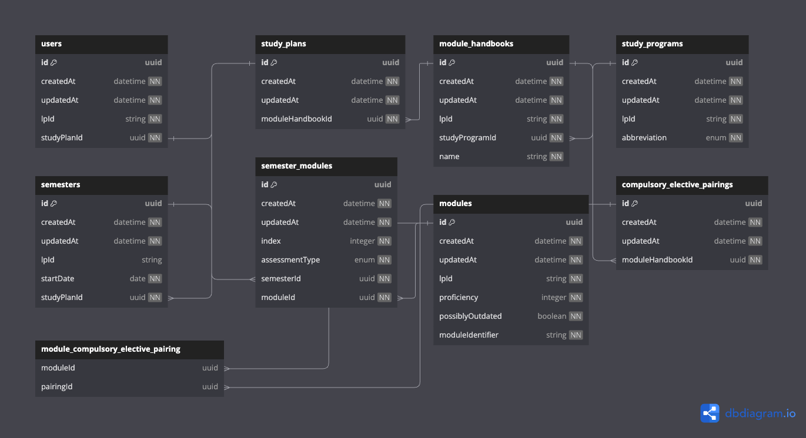

# study planner for CODE

a webapp that interacts with the graphql api of the code learning platform to help students plan their studies in advance and better understand their requirements.

## prerequisites

- [NodeJs](https://nodejs.org) >= 18.17.0
- [Docker](https://docs.docker.com/get-docker)
- [BunJs](https://bun.sh) (for running the seeding script)

## setup

##### (1) create a .env file matching the contents of .env.example

##### (2) start the docker container for the database

```bash
docker compose up
```

##### (3) run the seeding script for the database

this requires the additional `LP_ACCESS_TOKEN` environment variable, which can be the [learning platform access token](https://github.com/linusBolls/code-university-sdk/?tab=readme-ov-file#retrieving-an-access-token-from-the-code-learning-platform) of any account.

```bash
NODE_ENV=development bun run backend/seeding.ts
```

##### (4) install dependencies

```bash
npm install
```

##### (5) run the development server on http://localhost:3000

```bash
npm run dev
```

## contributing

study planner is open to PRs, issues, and general feedback!

## technical details



## use cases

- create your study plan by signing in with your access token
- drag and drop modules into your study plan
- preview your study progress and bachelor's grade
- get suggestions for your study plan
